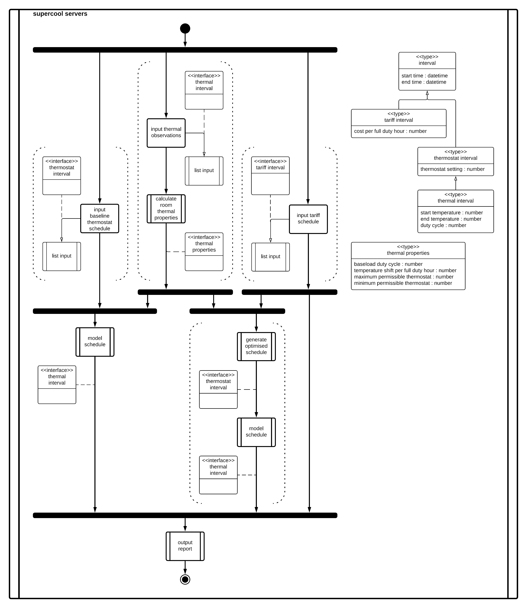

# An application to help inform the proactive cooling of server rooms

Inspired by ["Batteries aren't the only way to store power. Here's another."](https://www.youtube.com/watch?v=0f9GpMWdvWI) from Technology Connections.

## Motivation

As humanity seeks to manage its impact on Earth, electricity generation from low-carbon sources such as wind and solar will increase.
However, weather drives wind and solar power generation and is intermittent.
There are various techniques to account for this intermittency, such as battery storage, usage shaping and alternative baselines.
This project will focus on demand-side usage offsetting, which can form a valuable component of opportunity-oriented electrical grids.

Server rooms in temperate environments usually require active cooling from air conditioning units.
For example, the server room studied requires active cooling to offset the heat generated by the equipment and does not require other heat sources.
However, this cooling increases the operating expenses of a server room, whether measured in terms of currency, kilowatt-hours or greenhouse gas emissions.
By reducing these expenses, operators may achieve a more efficient server room without significant capital expense or reduction in quality.

Thermal mass reduces the rate at which temperature changes occur and, in this context, can be used as energy storage.
For example, a schedule may set the target temperature on an air-conditioner thermostat to a cooler temperature when electricity is cheaper.
As a result, the air-conditioner will draw more heat energy from the room than routine operations require, and the thermal mass will cool.
Conversely, the same schedule may resume the normal target temperature during expensive electricity tariffs.
The thermal mass, being colder than the target temperature and the passive equilibrium of the room, will absorb some heat energy and slow the room's warming.
This offsetting of operation through time is equivalent to storing energy when power is cheap and using it when power is expensive.

## Deliverables

This project will create an application that can gather the data required via a survey, model the thermal characteristics of the room, compute an optimised thermostat schedule and present the forecast savings.
The project assumes that its audience is technical, consistent with having some responsibility for a server room's thermal controls.

The system cannot assume that the server room has a smart thermostat since its purposes include justifying such an expense.
Therefore, to gather the dataset, a technician might observe aspects of the server room.
The dataset required to compute the desired report is not trivial, so a guided survey will improve accuracy, reliability and uptake.
Furthermore, this survey is likely to be conducted on a portable device, so interface development should support small screen sizes.

The system will mathematically model the thermal properties of the server room through time in different configurations.
This modelling will allow the comparison of configurations in a printable, business-oriented report.
One of these configurations will be computed algorithmically, with this algorithm being developed and implemented during the project.
Client-side storage, communication and processing should fulfil all the project requirements; therefore the server-side infrastructure need not expand beyond content delivery.

## Lifecycle

This project has a firm time budget, which must be respected when considering scope and quality.
The 32-week lifecycle budgets 7.5 hours to project work per week.
This budget resolves to about six full-time equivalent weeks.

In choosing the software development model, the first consideration is positioning on the spectrum from waterfall to agile.
This project has a small, well-bounded and useful product within a sizeable pluripotential scope for development.
For example, the MVP could consist of a data-gathering flow, a thermal model with no passive cooling, a simple schedule optimisation algorithm and a brief final report.
The scope for improving this offering includes improving any of these functional requirements, adding integration with APIs, IoT, and modelling passive cooling effects.
It is also worth noting that it is not a critical system and the project commissioners require several milestones.
Therefore, this project organisation will be agile.

Figure n.n - Initial project outline, showing boundaries of MVP.

There are several models for agile software development with varying suitability for project contexts.
For example, this project team is a single developer, so there is little value in specific roles and coordination events.
During the lifecycle of this project, the product will be a website, which would encourage continuous improvement and continuous delivery.
In contrast, if the product develops beyond this project, there is value to targetting an IoT context.
This context would suggest a more discrete deployment model, but a continuous pipeline can easily adopt pinned releases.
Based on these observations and the principle of only adding processes when they add value, the initial development model will be Kanban.

The first delivered use case will be an assisted survey of a site's thermal properties.
This use case is selected because the project runs from February to September, so collecting data as early as possible will cover a more significant seasonal variance.
At the other end of the project lifecycle, the final submission should include options for future development, captured as backlog cards.
The product potential exceeds the project budget, but there is still value in recording these options.

## Architecture

Figure n.n - Activity diagram showing data flow for optimising a schedule and presenting a report.

In deciding the deployment artefacts, there are several pertinent aspects.
First, all the data driving this model is from the primary observations of the technician or third party APIs.
Second, the modelling expected is not intensive, so calculation performance is a minor factor.
Third, there is value to data communication and sharing, but this is not an essential feature.
Finally, this should be available without installation as a significant proportion of users are likely to be single-use.
These requirements suit deployment as a stand-alone website using client-side data retention and processing.

Due to the project time constraints, the language and framework must be familiar to the developer.
In addition, the project is quite data-centric, so it favours a strong type system.
Alongside this, the immediate context for deployment is the web, so the language choice must support this.
Finally, there is also potential for IoT and mobile deployments, which should steer consideration.
Within these criteria, TypeScript seems the best choice for language.
It has a modern type system, is compilable to ECMAScript for web deployment, can be executed in Node.js for IoT deployment and is familiar to the developer.
One concern is its deployability into mobile contexts, but the *-native projects should accommodate this.

The selection of a framework is more balanced than language, with close competition between the React and Vue.js frameworks.
Server-side rendering of the DOM adds unnecessary components, specifically server-side processing, so it is undesirable.
Direct DOM manipulation is not sustainable or manageable.
As tie-breaker considerations, the Vue.js experience was more developer-friendly, and it has a higher quantity of GitHub stars.
In conclusion, this project will use Vue.js, especially single file components, but this was a close decision.

| Language      | Types     | Deployability | Familiarity   |
| ------------- | --------- | ------------- | ------------- |
| Java          | Strong    | N/A           | Low           |
| ECMAScript    | None      | Web, IoT      | High          |
| TypeScript    | Strong    | Web, IoT      | High          |
| Python        | Weak      | IoT           | Medium        |
| Dart          | Strong    | Web, Mobile   | Low           |

| HTML Framework    | Familiarity   | Suitability   | GitHub Stars  |
| ----------------- | ------------- | ------------- | ------------- |
| Server-side       | Medium        | Low           |               |
| Direct DOM        | Medium        | Low           |               |
| React             | Low           | High          |               |
| Vue               | Low           | High          |               |

Figure n.n - Feature comparison matrix of language options.

## Glossary

| Term          | Definition                                                                    |
| ------------- | ----------------------------------------------------------------------------- | 
| Technician    | An individual who maintains the environmental conditions of a server room.    |

## Bibliography

| Title                                                             | Publisher                 | Publication Date  | Link                                                                                  | Accessed      | Summary of Relevance  |
| ----------------------------------------------------------------- | ------------------------- | ----------------- | ------------------------------------------------------------------------------------- | ------------- | --------------------- |
| Batteries aren't the only way to store energy. Here's another.    | Technology Connections    | 2021-07           | <https://www.youtube.com/watch?v=0f9GpMWdvWI>                                         | 2021-11-21    | Project inspiration   |
| Kanban vs Scrum                                                   | Atlassian                 | 2018-08           | <https://www.atlassian.com/agile/kanban/kanban-vs-scrum>                              | 2021-12-11    | Development process   |
| What is Kanban?                                                   | Kanbanize                 | 2017-06           | <https://kanbanize.com/kanban-resources/getting-started/what-is-kanban>               | 2022-01-02    | Development process   |
| The Scrum Guide                                                   | Scrum Guides              | 2020-11           | <https://scrumguides.org/docs/scrumguide/v2020/2020-Scrum-Guide-US.pdf>               | 2022-01-02    | Development process   |
| Manifesto for Agile Software Development                          | Agile Alliance            | 2001-02           | <https://agilemanifesto.org>                                                          | 2022-01-02    | Development process   |
| What is a Web Framework, and Why Should I use one?                | We Learn Code             | 2020-04           | <https://welearncode.com/what-are-frontend-frameworks>                                | 2022-01-29    | Language choice       |
| vuejs/vue: Vue.js is a progressive, incrementally-adoptable ...   | You, E                    | 2021-06           | <https://github.com/vuejs/vue>                                                        | 2022-01-29    | Language choice       |
| facebook/react: A declarative, efficient, and flexible ...        | Facebook                  | 2021-03           | <https://github.com/facebook/react>                                                   | 2022-01-29    | Language choice       |
| How To Use TypeScript with Vue Single File Components             | DigitalOcean              | ??                | <https://www.digitalocean.com/community/tutorials/vuejs-using-typescript-with-vue>    | 2022-01-30    | Technical guide       |