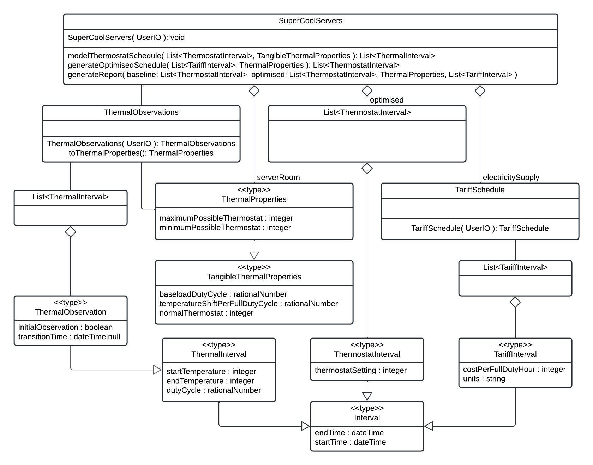

# An application to inform the proactive cooling of server rooms

Inspired by ["Batteries aren't the only way to store power. Here's another."](https://www.youtube.com/watch?v=0f9GpMWdvWI) from Technology Connections.

## Table of Contents

## 1 - Project Management

### 1.1 - Motivation

As humanity seeks to manage its impact on Earth, electricity generation from low-carbon sources such as wind and solar will increase.
However, weather drives wind and solar power generation and is intermittent.
There are various techniques to account for this intermittency, such as battery storage, usage shaping and alternative baselines.
This project will focus on demand-side usage offsetting, which can form a valuable component of opportunity-oriented electrical grids.

Server rooms in temperate environments usually require active cooling from air conditioning units.
For example, the Brighton Digital Exchange (BDX) requires active cooling to offset the heat generated by the equipment and does not require other heat sources (Airedale, 2015).
However, this cooling increases the operating expenses of a server room, whether measured in terms of currency, kilowatt-hours, or greenhouse gas emissions.
By reducing these expenses, operators may achieve a more efficient server room without significant capital expense or reduction in quality.

Thermal mass reduces the rate at which temperature changes occur and, in this context, can be used as energy storage.
For example, a schedule may set the target temperature on an air-conditioner thermostat to a cooler temperature when electricity is cheaper.
As a result, the air-conditioner will draw more heat energy from the room than routine operations require, and the thermal mass will cool.
Conversely, the same schedule may resume the normal target temperature during expensive electricity tariffs.
The thermal mass, being colder than the target temperature and the passive equilibrium of the room, will absorb some heat energy and slow the room's warming.
This offsetting of operation through time is equivalent to storing energy when power is cheap and using it when power is expensive.

### 1.2 - Deliverables

This project will create an application to steer a server room technician towards more efficient scheduling.
It will gather the data required via a survey, model the thermal characteristics of the room, compute an optimised thermostat schedule, and present the forecast savings.
The project assumes that its audience is technical, consistent with having some responsibility for a server room's environmental controls.

The system cannot assume that the server room has a smart thermostat since its purposes include justifying such an expense.
Therefore, to gather the dataset, a technician might observe the thermal properties of the server room.
The dataset required to compute the desired report is not trivial, so a guided survey will improve accuracy, reliability, and uptake.
Furthermore, this survey is likely to be conducted on a portable device, so interface development should support small screen sizes.

The system will mathematically model the thermal properties of the server room through time in different configurations.
This modelling will allow the comparison of configurations in a printable, business-oriented report.
One of these configurations will be computed algorithmically, with this algorithm being developed and implemented during the project.

### 1.3 - Lifecycle

This project has a firm time budget, which must be respected when considering scope.
The 32-week lifecycle budgets 7.5 hours to project work per week.
This budget resolves to about six full-time equivalent weeks.

In choosing the software development model, the first consideration is positioning on the spectrum from waterfall to agile.
This project has a small, well-bounded and useful product within a sizeable pluripotential scope for development.
For example, the minimum viable product (MVP) could consist of a data-gathering flow, a simplified thermal model, a schedule optimisation algorithm and a brief final report.
Alongside architecture decisions and toolchain initialisation, this MVP will require an estimated 70% of the project budget.
The scope for improving this offering includes iteratively improving any of these functional requirements, adding integration with APIs, the internet of things (IoT), and more accurate modelling.
It is also worth noting that it is not a critical system and the project commissioners require several milestones.
In conclusion, this project will be organised in an agile fashion, prompted mainly by the relative scale of MVP and potential.
The MVP development will be a series of small increments, with further development being incremental or iterative as required.

Figure 1.3.1 - Initial project outline, showing boundaries of MVP.

There are several models for agile software development with varying suitability for project contexts.
For example, this project team is a single developer, so there is little value in specific roles and coordination events.
During the initial lifecycle of this project, the product will be a website, which would encourage continuous improvement and continuous delivery.
In contrast, if the product develops beyond this project, there is value to targeting an IoT context.
This context would suggest a more discrete deployment model, but a continuous pipeline can easily adopt pinned releases.
Based on these observations and the principle of only adding processes when they add value, the project development model will be Kanban.

The first delivered use case will be an assisted survey of a site's thermal properties.
This use case is selected because the project runs from February to September, so collecting data as early as possible will cover a more significant seasonal variance.
At the other end of the project lifecycle, the final submission should include options for future development, captured as backlog cards.
The product potential exceeds the project budget, but there is still value in recording these options.

## 2 - Project work

### 2.1 - Roadmap

In accordance with the project lifecycle adopted, this is several lists of stakeholder stories, each in the format `A (stakeholder) (must|should|could|will not) …`.
This project adapts the core Kanban board by broadening the scope of concerns from "user stories" to "stakeholder stories" and by adding a qualitative list to capture persistent requirements.
These stories will move in step with the code that implements them and reside in the code repository, so the project history is always accurate of that moment in time.

["Roadmap"](ROADMAP.md)

### 2.2 - Architecture

Figure 2.2.1 - Activity diagram showing data flow for optimising a schedule and presenting a report.

The core workflow of this system suits a notification and data flow architecture.
The workflow has several data gathering stages that favour compartmentalisation as user interfaces that gather the underlying data.
Each stage requires no intervention from other components and emits strongly typed updates.
By implementing these as components we allow each to encapsulate their user interface and bound their complexity.
The workflow also has several data processing stages that use the data gathered to medel and recommend thermal schedules.
Since these require several data objects and are closely related to the coordination between the phases, they reside in the coordinating class.

Figure 2.2.2 - Class diagram showing data relations and inheritance

In deciding the deployment artefacts, there are several pertinent aspects.
First, all the data driving this model is from the primary observations of the technician or third party APIs.
Second, the modelling expected is not intensive, so calculation performance is a minor factor.
Third, there is value to data communication and sharing, but this is not an essential feature.
Finally, this should be available without installation as a significant proportion of users are likely to be single-use.
These requirements suit deployment as a stand-alone website using client-side data retention and processing.

The main issue with this deployment style is migrating data from previous versions, as the data is not under the systems' control. 
To offset this issue, the top-level data objects will have version numbers, and there shall be a data loading procedure capable of stepping a dataset up the version numbers.

Due to the project time constraints, the language and framework must be familiar to the developer.
In addition, the project is quite data-centric, so it favours a strong type system.
Alongside this, the immediate context for deployment is the web, so the language choice must support this.
Finally, there is also potential for IoT and mobile deployments, which should steer consideration.
Within these criteria, TypeScript seems the best choice for language.
It has a modern type system, is compilable to ECMAScript for web deployment, can be executed in Node.js for IoT deployment and is familiar to the developer.
Of course, the entire product might derive value from a mobile-app deployment, but this is both beyond this project's scope and probably resolvable using the *-native projects.

The user interface framework selection is more balanced than language but with a couple of early eliminations.
First, direct DOM manipulation is not sustainable or manageable.
Secondly, server-side calculation of the HTML adds unnecessary components, specifically server-side processing.
Therefore client-side reactive web frameworks were favoured, simplifying the deployment and maintenance, with both Vue.js and React being familiar.
As tie-breakers, the Vue.js experience was more developer-friendly, and it has a higher quantity of GitHub stars.
In conclusion, this project will use Vue.js, especially single file components, but this was a close decision.

| Language      | Types     | Deployability | Familiarity   |
| ------------- | --------- | ------------- | ------------- |
| Java          | Strong    | N/A           | Low           |
| ECMAScript    | None      | Web, IoT      | High          |
| TypeScript    | Strong    | Web, IoT      | High          |
| Python        | Weak      | IoT           | Medium        |
| Dart          | Strong    | Web, Mobile   | Low           |

| HTML Framework    | Familiarity   | Suitability   | GitHub Stars  |
| ----------------- | ------------- | ------------- | ------------- |
| Server-side       | Medium        | Low           | N/A           |
| Direct DOM        | Medium        | Low           | N/A           |
| React             | Low           | High          | 182k          |
| Vue               | Low           | High          | 193k          |

Figure n.n - Feature comparison matrix of language options.

### 2.3 - Work Completed

For several reasons, gathering a set of thermal observations is a vital early milestone and this received priority above other concerns.
First, gaining access to an example server room provides a case study, and gathering these observations proves that access.
Furthermore, these observations will inform and verify modelling assumptions, which is improved by gathering these observations across as wide a range of seasons as possible.

Several elements were required to script this set of observations.
Most importantly, research into the thermal behaviour of rooms was conducted and supplemented by a quick survey of the BDX.
This research ensured that any detailed survey taken suited a fully formed model.
Since such a model would require calculations of how rapidly a room could change temperature, negotiation began to adjust the thermostat.
The BDX has been selected as a possible case study due to its close association with my employer and its likely philosophical alignment with the goals of this project.
The quick survey revealed that the server room windows are north facing and boarded over, so the initial model can ignore solar thermal effects.

Figure 2.3.1 - Plan of the server room surveyed

To support this survey, the developer initialised the UI of this project, designed the survey's workflow, and implemented this in the interface.
The UI consists of a reactive website with custom data-gathering components, targeting low resolutions and touchscreen interaction to support smartphone usage.
Within this, the survey asks about the room as it moves between and maintains different temperatures.
As a result, this data should support an intermediate thermal model.

Figure 2.3.2 - Overview of the thermal survey workflow.

Figure 2.3.3 - Web interface at 360 x 640.

### 2.4 - Simplifications

This section records the simplifying assumptions currently applied to the modelling process.
These simplifications should not be treated as final but should be justified or removed if possible.
* The server room comprises equipment racks, well-circulated air, air conditioning and thermal mass.
  * All electricity consumed by the server hardware becomes heat.
  * The server hardware generates a steady heat output.
  * The air conditioning performs equivalently in all temperatures.
  * The insulation within this space is insignificant.
  * The propagation of heat through this space is instantaneous.
* Passive thermodynamic effects are constant.
  * Observing the duty cycle during different ambient conditions can confirm this.
  * Server rooms are not typically subject to solar radiative warming.
  * Adopting this assumption unblocks creating a UX using a basic model.
  * This assumption pushes integrating with weather forecasts outside the MVP.
* An insulating layer surrounds the server room. This assumption is currently irrelevant because "Passive thermodynamic effects are constant".
  * The thermal mass of this layer is insignificant.
  * Radiative thermal effects through windows are constant.
* Outside the insulating layer are ambient environments. This assumption is currently irrelevant because "Passive thermodynamic effects are constant".
  * There are precisely two ambient environments.
  * One of these is external and is subject to weather.
  * One of these is internal and is thermostatically regulated.
  * The server room does not affect the ambient environments.
* Thermal units, such as coefficient of production and joules of thermal energy, can be eliminated from the model.
  * Passive observations measure the duty cycle required to maintain temperature differences.
  * Active observations measure the duty time required to enact temperature changes.
  * The duty cycle is directly proportional to the resource cost required without needing thermal units.
  * The basic units become `duty`, `celsius` and `hour`.
  * e.g., passive cooling reduces the duty cycle of the air conditioning by 3% per celsius difference.
  * e.g., changing the server room's temperature requires one duty hour per celsius.
  * e.g., running the air conditioning uses 1 ton of CO2 per duty hour.

These simplifications seem reasonable for the BDX and some other server rooms (see 2.6 - Thermodynamics) but could limit the project's generalisation to other contexts.
Further research is warranted and scheduled to estimate the restrictiveness of each of these simplifications.

A quick survey of server room photographs reinforces this assumption but is not yet at reasonable rigour.
For example, most server rooms do not have significant glazed surfaces that would conduct heat.
In addition, the building materials used in most server rooms will provide but not prioritise insulation.

Figure 2.6.2 - Quick survey of typical server room construction, DuckDuckGo 2022

### 2.5 - Blockers

Figure 2.5.1 - Risk assessment grid for the project

To achieve the task, "*A technician should have information on an example server room available.*" the project requires permission to observe and adjust the thermostat of a server room.
This permission is critical as the risk has a high likelihood and high impact.
This concern is likely because the temperature is a tightly controlled aspect of a server room.
Furthermore, it is impactful because this example provides feedback about the user experience and gives the project a case study.

Therefore, negotiation-in-principle started immediately upon beginning the project to bring any related decision point forwards.
Now that we have outlined a survey workflow, the developer is negotiating access to perform the required tasks.
This negotiation does have the possibility of failure due to the management committee of the BDX being external to the project.
If this negotiation fails, the project may seek a different case study, continue without a case study or transition to modelling a more available example of thermodynamics and power offsetting, such as domestic refrigerators.

To achieve or defer the task, "*A technician should be able to model a room with significant passive cooling.*" the project must incorporate learning into the mathematics of thermodynamic cooling.
Failing in this learning is of medium likelihood as the science is sure to be public domain but is also likely to be intermediate level.
In addition, this research is of high impact as it can underwrite and prioritise other simplifications.
Therefore, achieving a basic understanding of this field is second only to finding an engaging case study, and is the target of early secondary research efforts.

### 2.6 - Thermodynamics

There are multiple routes by which a server room sheds heat.
Principal among these will be the air conditioning systems which good practice states will exceed the cooling requirements using an N + 1 redundant infrastructure.
The room will also conduct heat through its surface area to both indoor and outdoor environments.
This cooling is all set against the heat a room generates from the servers it contains.

Figure 2.6.1 - Building management system (BMS) interface, Airedale 2015

Two 51.6kW air conditioning units cool the BDX for a total cooling power of 103.2kW.
This infrastructure is N + 1 redundant, implying a cap upon server equipment at 51.6kW before upgrades.
The BDX complements this with precision units that cool the server equipment by heating the room's environment.

The BMS holds the room at 20 degrees celsius, and the external temperature varies between 3 and 20 degrees celsius.
The external wall comprises a concrete wall, an access corridor and a single pane glass wall of about 44 m^2.
Therefore, an upper estimate of cooling through this wall (rounded up to 2 s.f.) is 1.8 kilowatt (see Appendix I).
This estimate puts a medium prioritisation on modelling weather conditions in this situation.

The remaining surfaces of the BDX separate the room from other offices and underground with a surface area of around 330 m^2.
The calculations model a 2 kelvin difference with the data hall to estimate significance.
An upper estimate of cooling through the floor, ceiling, internal, and underground walls is 1.3 kilowatts (rounded up to 2 s.f.) (see Appendix I).
This estimate puts a medium prioritisation on modelling passive cooling.

### 2.7 - Glossary

| Term          | Type          | Definition                                                                                                                        |
| ------------- | ------------- | --------------------------------------------------------------------------------------------------------------------------------- | 
| Technician    | Stakeholder   | An individual who maintains the environmental conditions of a server room; they usually surface usability concerns.               |
| Customer      | Stakeholder   | An organisation that may decide to adopt thermostat recommendations based on the report; they usually surfaces utility concerns.  |
| <<type>>      | Software term | An abstract data structure, like an interface, except it asserts that objects shall possess certain data types instead of methods |

## 3 - Literature

### 3.1 - References

Airedale (2015) ‘*ACIS provides the big picture at Brighton Digital Exchange*’. Available at: https://www.airedale.com/case-studies/acis-provides-the-big-picture-at-brighton-digital-exchange (accessed: 2022-02-14).

CIBSE (2015) ‘*Environmental Design – CIBSE Guide A (8th Edition)*’.

DuckDuckGo (2022) ‘*Server room image search at DuckDuckGo*’. Available at: https://duckduckgo.com/?q=server+room&t=h_&iax=images&ia=images (accessed 2022-02-15).

Naver Corp. (2022) '*Region With Timeseries*'. Available at https://naver.github.io/billboard.js/demo/#Region.RegionWithTimeseries (accessed 2022-04-19).

OpenLearn (2019) ‘*Energy in buildings*’. Available at: https://www.open.edu/openlearn/nature-environment/energy-buildings (accessed 2022-02-15).

Palantir (2021) '*Background Bands*'. Available at: http://plottablejs.org/examples/bands/ (accessed 2022-04-19).

StatCounter (2022) '*Screen Resolution Stats Worldwide*'. Available at: https://gs.statcounter.com/screen-resolution-stats (accessed 2022-04-19).

Sudlows (2015) ‘*Brighton Digital Exchange Data Centre*’. Available at: https://www.sudlows.com/wp-content/uploads/2016/07/Brighton-Digital-Exchange.pdf (accessed 2022-02-14).

Technology Connections (2021) ‘*Batteries aren't the only way to store energy. Here's another*’. Available at https://www.youtube.com/watch?v=0f9GpMWdvWI (accessed 2021-11-21).

Toast.com (2021) '*8.15 [Line Chart] Plot Bands, Line*'. Available at: http://nhn.github.io/tui.chart/latest/tutorial-example08-15-line-chart-plot-bands-lines (accessed 2022-04-19).

You, E. et al (2022) '*vuejs/core v3.2*'. Available at: https://github.com/vuejs/core (accessed 2022-04-19).

### 3.2 - Bibliography

Agile Alliance (2001) ‘*Manifesto for Agile Software Development*’. Available at: https://agilemanifesto.org (accessed: 2022-01-02).

Atlassian (2019) ‘*What is Agile?*’. Available at: https://www.atlassian.com/agile (accessed 2022-02-15).

amCharts.com (2022) '*amCharts 5 Demos*'. Available at: https://www.amcharts.com/demos/ (accessed 2022-04-19).

ApexCharts.com (2022) '*JavaScript Chart Demos*'. Available at: https://apexcharts.com/javascript-chart-demos/ (accessed 2022-04-19).

Au-Yeung, J. (2021) '*Vue.js 3 By Example*'. Birmingham: Packt Publishing, Limited.

Berning, D. (2020) ‘*How To Use TypeScript with Vue Single File Components*’, DigitalOcean. Available at: https://www.digitalocean.com/community/tutorials/vuejs-using-typescript-with-vue (accessed: 2022-01-30).

Chartjs.org (2022) '*Chart.js*'. Available at: https://www.chartjs.org/docs/latest/samples/information.html (accessed 2022-04-19).

Dygraphs.com (2017) '*Draws a time series with weekends highlighted*'. Available at: https://dygraphs.com/gallery/#g/highlighted-weekends (accessed 2022-04-19).

Facebook (2021) ‘*A declarative, efficient, and flexible JavaScript library for building user interfaces*’. Available at: https://github.com/facebook/react (accessed: 2022-01-29).

Frappe.io (2021) '*Modern, Open Source SVG Charts*'. Available at https://frappe.io/charts (accessed 2022-04-19).

Gamma, E., Helm, R., Johnson, R. & Vlissides, J. (1994) '*Design Patterns*'.

Gimp Team (2022) '*GNU Image Manipulation Program*'. Available at https://www.gimp.org/ (accessed 2022-04-19).

Google Docs Support Forums (2020) '*Not able to insert SVG image in Google Docs*'. Available at: https://support.google.com/docs/thread/79758249/not-able-to-insert-svg-image-in-google-docs (accessed 2022-04-19).

Holland, A. (2021) ‘*Creating A Custom Range Input That Looks Consistent Across All Browsers*’, Smashing Magazine. Available at: https://www.smashingmagazine.com/2021/12/create-custom-range-input-consistent-browsers (accessed: 2022-02-02).

Kanbanize (2017) ‘*What is Kanban?*’. Available at: https://kanbanize.com/kanban-resources/getting-started/what-is-kanban (accessed: 2022-01-02).

Microsoft Support (2021) '*Graphic file types you can insert and save*'. Available at: https://support.microsoft.com/en-us/office/graphic-file-types-you-can-insert-and-save-dad53574-3384-4ced-b472-348d37c326a7 (accessed 2022-04-19).

Mozilla Developer Network (2022) '*HTMLCanvasElement.toDataURL()*'. Available at https://developer.mozilla.org/en-US/docs/Web/API/HTMLCanvasElement/toDataURL (accessed 2022-04-19).

Novus Partners (2014) '*NVD3 Re-usable charts for d3.js*'. Available at: https://nvd3.org/ (accessed 2022-04-19).

Rehkopf, M. (2018) ‘*Kanban vs Scrum*’, Atlassian. Available at: https://www.atlassian.com/agile/kanban/kanban-vs-scrum (accessed: 2021-12-11).

Ribeiro, H.R. (2020) '*Vue.js 3 Cookbook*'. Birmingham: Packt Publishing, Limited.

Schwaber, K. & Sutherland, J. (2020) ‘*The Scrum Guide*’, Scrum Guides. Available at: https://scrumguides.org/docs/scrumguide/v2020/2020-Scrum-Guide-US.pdf (accessed: 2022-01-02).

Spolsky, J. (2000) '*The Joel Test*'. Available at: https://www.joelonsoftware.com/2000/08/09/the-joel-test-12-steps-to-better-code/ (accessed 2022-04-19).

Syed, B. A. (2017) '*TypeScript Deep Dive*'. Availble at: https://basarat.gitbook.io/typescript/ (accessed: 2022-03-20).

TypeScript (2022) '*The TypeScript Handbook*'. Available at: https://www.typescriptlang.org/assets/typescript-handbook.pdf (accessed: 2022-03-20).

Valutis, O (2015) ‘*Styling and Customizing File Inputs the Smart Way*’. Available at: https://tympanus.net/codrops/2015/09/15/styling-customizing-file-inputs-smart-way (accessed: 2022-02-13).

vis.js (2022) '*Vis Graph2D Examples*'. Available at: https://visjs.github.io/vis-timeline/examples/graph2d/ (accessed 2022-04-19).

We Learn Code (2020) ‘*What is a Web Framework, and Why Should I use one?*’. Available at: https://welearncode.com/what-are-frontend-frameworks (accessed: 2022-01-29).

w3.org (2015) '*Graceful degradation versus progressive enhancement*'. Available at: https://www.w3.org/wiki/Graceful_degradation_versus_progressive_enhancement (accessed 2022-04-19).

w3schools.com (2022) '*SVG Tutorial*'. Available at: https://www.w3schools.com/graphics/svg_intro.asp (accessed 2022-04-19).

### 3.3 - To Read

Aizawa, N. (2020) ‘Study on a Cooling System with Power Usage Effectiveness of 1.02 for Server Rooms’, ASHRAE transactions, 126(1), p. 212–.

Koch, B. and Slezak, D. (2017) ‘Poster Abstract: Less energy, more efficiency in server rooms and data centers: A campaign by the Swiss Telecommunications Association’, Computer science (Berlin, Germany), 33(1-2), pp. 251–252. doi:10.1007/s00450-017-0369-0.

Sasakura, K. et al. (2020) ‘Rack Temperature Prediction Model Using Machine Learning after Stopping Computer Room Air Conditioner in Server Room’, Energies (Basel), 13(17), p. 4300–. doi:10.3390/en13174300.

Sasakura, K. et al. (2020) ‘A Temperature-Risk and Energy-Saving Evaluation Model for Supporting Energy-Saving Measures for Data Center Server Rooms’, Energies (Basel), 13(19), p. 1–. doi:10.3390/en13195222.

Nada, S.A. et al. (2017) ‘Experimental parametric study of servers cooling management in data centers buildings’, Heat and mass transfer, 53(6), pp. 2083–2097. doi:10.1007/s00231-017-1966-y.

Macedo, D. et al. (2019) ‘A Parametric Numerical Study of the Airflow and Thermal Performance in a Real Data Center for Improving Sustainability’, Applied sciences, 9(18), p. 3850–. doi:10.3390/app9183850.

Duda, S.W. (2018) ‘N+1 HVAC for IT Closets And Server Rooms’, ASHRAE journal, 60(5), p. 56–.
