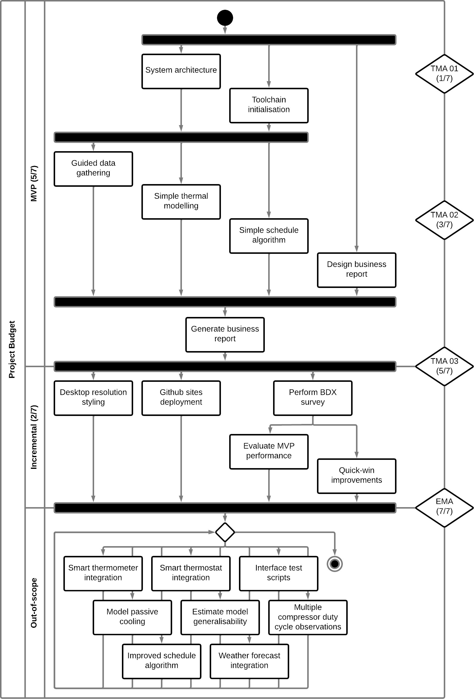
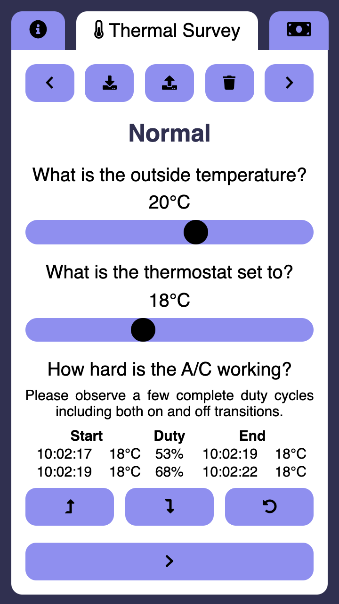

# An application to inform the proactive cooling of server rooms

Inspired by ["Batteries aren't the only way to store power. Here's another."](https://www.youtube.com/watch?v=0f9GpMWdvWI) from Technology Connections.

## Table of Contents

1. Project Intent
	1. Environmentally Responsible Electricity Grids
	1. Server Room Load Shaping
1. Project Plan
	1. Deliverables
	1. Lifecycle
	1. Requirements
	1. Risk Management
	1. Legal, Social, Ethical and Professional Issues
1. Project Progress
	1. Thermodynamic Modelling
	1. Simplifications
	1. User Experience
	1. Output
	1. Software Architecture
	1. Implementation
1. Project Reflection
	1. MVP Review
	1. General Reflection
* Glossary
* Literature
	1. References
	1. Bibliography
* Appendix I, Insulation calculations
* Appendix II, Access negotiations
* Appendix III, Project log
* Appendix IV, Code
* Appendix V, Roadmap
* Appendix VI, Questionnaire

## 1 - Project Intent

### 1.1 - Environmentally Responsible Electricity Grids

As humanity seeks to manage its impact on Earth, electricity grids must shift onto a more environmentally responsible paradigm.
Various techniques contribute to this intent, and this project will focus on one form of load shaping.
It will consider offsetting server room cooling through time to prioritise more environmentally responsible power scheduling.
The project will deliver this consideration as a web application to promote scalability and adoption.

One fundamental property of an electrical grid is that the energy delivered during one cycle must match the energy consumed, which requires careful balancing.
An electricity grid engineered for environmental responsibility will include several power balancing techniques due to diversity in their disadvantages.
Battery-based electricity storage requires large amounts of rare metals.
Pumped hydro energy storage requires lakes with varying water levels.
The use of nuclear fission to generate baseload power is unpopular.
Wind and solar generation are intermittent because they are weather-based.
Local climate and topography limit hydroelectric generation.
Finally, load shaping requires changes in consumer habits.
These techniques are individually valuable and can receive independent consideration while maintaining their ability to be coupled into a holistic system.

### 1.2 - Server Room Load Shaping

Load shaping refers to techniques that seek to balance a grid by influencing the usage of electricity rather than the supply.
Electricity companies use load shaping tariffs to align customer usage patterns with power generation.
The electrical load of a server room usually includes cooling, which good practice states should exceed requirements.
Therefore, this cooling can be exaggerated during cheaper electrical tariffs, removing heat earlier so the system can rest during more expensive tariffs.
This project will support rescheduling the air conditioning of a server room as a load shaping technique.

Historically, electricity companies have used day/night tariffs to flatten electricity demand to encourage a steady overall load.
Recently, electricity companies have started offering tracker and variable tariffs (Octopus Energy, 2022) to suit fluctuations in intermittent power sources.
Since these tariff intervals vary in price, carbon dioxide emissions, and other performance metrics, they can steer electrical equipment usage.

Server rooms in temperate environments usually require active cooling from air conditioning units.
According to good practice guides this cooling capacity ought to exceed basic requirements to allow for maintenance and interruptions.
For example, the Brighton Digital Exchange (BDX) uses two air conditioning units to remove the heat generated by the equipment (Airedale, 2015).
However, this cooling contributes to the operating expenses of a server room, whether measured in terms of currency, kilowatt-hours, or greenhouse gas emissions.
Operators will seek to achieve a more efficient server room without significant capital expense or reduction in quality.

Thermal mass is a property of all materials and quantifies the observation that temperature changes do not occur instantly.
Instead, materials release and absorb thermal energy, depending on whether they are warmer or cooler than their environment.
So, for example, after setting an air conditioner colder, the air will cool, and the building materials will lag behind this; the materials will release thermal energy and slow the cooling of the air.
Conversely, after setting the air conditioner warmer, the building materials will be colder, slowing the warming. During these transitions, the air conditioner will work at full power while the room is warmer than the target temperature (Zone A in Figure 1.2.1), and it will rest while the room is colder than the target temperature (Zone B in Figure 1.2.1).

Figure 1.2.1 - A graph of temperatures through time

In conclusion, a cyclical schedule may set the target temperature on an air-conditioner thermostat to a cooler temperature when electricity is cheaper.
As a result, the air-conditioner will draw more heat from the room than routine requirements, and the building materials will cool.
Conversely, the same schedule may resume the normal target temperature during expensive electricity tariffs.
The building materials, being colder than the target temperature, will absorb thermal energy and slow the room's warming.
This offsetting of work through time is equivalent to storing energy when power is cheap and releasing it when power is expensive.

## 2 - Project Plan

### 2.1 - Deliverables

This project will create an application to steer a server room technician towards more efficient air conditioner scheduling.
It will gather the data required via a survey, model the thermal characteristics of the room, compute an improved thermostat schedule, and present the forecasted savings.
The project assumes that its audience is technical, consistent with having some responsibility for a server room's environmental controls.

The system cannot assume that the server room has a smart thermostat since its output might be part of justifying such an expense.
Therefore, to gather the dataset, a technician might observe the thermal properties of the server room.
The dataset required to compute the desired report is not trivial, so a guided survey will improve accuracy, reliability, and uptake.
Furthermore, the technician will likely use a portable device, so interface development should target small screen resolutions.

The system will mathematically model the thermal properties of the server room through time in different configurations.
This modelling will allow the comparison of configurations in a printable, business-oriented report.
One of these configurations will be computed algorithmically, with this algorithm being developed and implemented during the project.
The developer will use test-driven development and automated testing for all modelling aspects of this product.
This philosophy will ensure that solid mathematical foundations underpin the model.
Any deliverable subset of the product, especially each project milestone, should be evaluated against the dual criteria of improving the features delivered and supporting the development of features imagined.
The project will explicitly document this at each milestone and also adopt this implicitly as a healthy part of commit hygiene.

### 2.2 - Lifecycle

This project has a firm time budget, which must be respected when considering scope.
The 32-week lifecycle budgets 7.5 hours to project work per week.
This budget resolves to about six full-time equivalent weeks.

The first consideration in choosing the software development model is positioning on the spectrum from waterfall to agile.
This project has a small, well-bounded, useful product within a sizeable pluripotential scope for development.
For example, the minimum viable product (MVP) could consist of a data-gathering flow, a simplified thermal model, a schedule improvement algorithm and a brief final report.
Alongside architectural decisions and toolchain initialisation, this MVP will require an estimated 70% of the project budget.
The scope for improving this offering includes iteratively improving any of these functional requirements, adding integration with APIs, the internet of things (IoT), and more accurate modelling.
It is also worth noting that it is not a critical system and the project commissioners require several milestones.
In conclusion, this project will be organised in an agile fashion, prompted mainly by the relative scale of MVP and potential.
The MVP development will be a series of small increments, with further development being incremental or iterative as required.

Figure 2.2.1 - Initial project schedule, showing boundaries of MVP.

Several agile software development models exist, with varying suitability for project contexts.
For example, this project team is a single developer, so there is little value in specific roles and coordination events.
During the lifecycle of this project, the product will be a website, which would encourage continuous improvement and continuous delivery.
In contrast, if the product develops beyond this project, there is value to targeting an IoT context.
This context would suggest a more discrete deployment model, but a continuous pipeline can easily adopt pinned releases.
Based on these observations and the principle of only adding processes which add value, the project development model will be Kanban.

Consistent with the lifecycle model chosen, the project accepts that a requirements specification is continuous, reflective and discovered.
Therefore, distant goals are recorded in an outline form to maintain agility and reduce speculative specification.
These encapsulate improvements visible to the project but beyond the current priority's scope.
As a priority begins and proceeds, the team will decompose these goals into more specific tasks.
Active reflection occurs as each task is committed to the repository, considering code quality, feature completeness and transferrable learning.
Finally, as a milestone concludes, the team must consider which goals warrant their subsequent efforts.
At the project conclusion, it is correct that the final submission includes goals for future development, captured as backlog cards.
The product potential exceeds the project budget, but there is still value in recording these options.

The reflection and self-improvement in this lifecycle model occur at two frequencies.
The least frequent reflection opportunities occur in-between priorities; these suit consideration of the project budget, schedule and direction.
The first happened after the initial whiteboarding of the project, and the estimates of domain research and project schedule come from this reflection.
Another project overview will occur after the MVP.
Secondly, the development effort is organised into commits, each a quantum of improvement.
As each is committed to the repository, the contributor takes a deliberate moment to ensure that the code is of reasonable quality and explain what value the code delivers.
One risk experienced with continual learning and self-improvement is the temptation to refactor existing code.
To yoke this temptation a deliberate opportunity is given at the end of each priority to apply later learning to earlier development.

Figure 2.2.2 - Limiting revisits while adopting continual improvement

The first delivered use case will be a guided survey of a room's thermal properties.
This use case is selected because the project runs from February to September, so collecting data as early as possible will cover a more significant seasonal variance.
Therefore, this deliverable will include just enough research to ensure data relevance, just enough interface that a technician can comfortably operate the system and just enough workflow for a customer to perceive the value.
Immediately upon completing this deliverable, there will be an opportunity to reflect on the product direction, schedule and lessons.

### 2.3 - Requirements

Following the project lifecycle model adopted, this is several lists of stakeholder stories, each in the format `A (stakeholder) (must|should|could|will not) …`.
This project adapts the core Kanban board by broadening the scope of concerns from "user stories" to "stakeholder stories" and simplifying persistent concerns to a qualitative list.
These stories will reside in the repository and update with the code that fulfils them, so the project history is always up-to-date. For an up-to-date roadmap listing, see Appendix V.

To compile this list, the developer will be the first user ("dogfooding").
In selecting this requirements model, the project recognises the limited pool of potential stakeholder representatives and seeks to reap the advantages of streamlining.
The main risk with this is that the developer may be overly familiar with the oddities of their design, and this risk is acknowledged.

### 2.4 - Risk Management

|                  | 1 - Rare            | 2 - Unlikely        | 3 - Possible        | 4 - Likely          | 5 - Almost certain  |
| ---------------- | ------------------- | ------------------- | ------------------- | ------------------- | ------------------- |
| 1 - Trivial      |                     |                     | The project might underrun |              |                     |
| 2 - Minor        |                     | The project might overrun |               |                     |                     |
| 3 - Moderate     | All electrical tariff data might be priveledged | | Permission might be denied to adjust the thermostat | | |
| 4 - Major        |                     |                     |                     |                     |                     |
| 5 - Catastrophic |                     | The mathematics of thermal cooling might be too complicated | | |                     |

Figure 2.4.1 - Risk assessment grid for the project

To achieve the task, "A technician should have information on an example server room available." the project requires permission to observe and adjust the thermostat of a server room.
This permission is critical as the risk has a moderate likelihood and impact.
This likelihood is "possible" because the temperature is a tightly controlled aspect of a server room, offset by the corporate relationships and philosophy.
Furthermore, the impact is "moderate" because this example provides feedback about the user experience and gives the project a case study. 

Therefore, negotiation-in-principle started immediately upon beginning the project to bring any related decision point forwards.
Now that we have outlined a survey workflow, the developer is negotiating access to perform the required tasks.
If this negotiation fails, the project may continue without a case study or transition to modelling a more available example of thermodynamics and power offsetting, such as domestic refrigerators.

To achieve or defer the task, "A technician should be able to model a room with significant passive cooling." the project must incorporate learning into the mathematics of thermodynamic cooling.
Failing in this learning is "unlikely" as the science is sure to be public domain but is also likely to be intermediate level.
In addition, this research is of "catastrophic" impact as it underwrites the model and prioritises simplifications.
Therefore, achieving a basic understanding of this field is second only to finding an engaging case study, and is the target of early research efforts.
A raw analysis of the risk assessment would prioritise this above thermostat permission.
However, the schedule placed this second because it relies on fewer factors external to the project and therefore experiences a lower latency.

As with any project, there is a risk that the scope will not match the budget.
In addition, since this project includes research and discovery aspects, it is challenging to reconcile these two ledgers in advance.
To mitigate the dual risks of overrun and underrun, the project will deliver a viable product before the deadline, providing an opportunity to reflect, re-scope and improve.

### 2.5 - Legal, Social, Ethical and Professional Issues

The project involves data processing, so it must respect data protection principles.
Architecting the project to distribute the interface, model and algorithms for client-side processing means it avoids data confidentiality issues.
This architecture also has the benefit that it eliminates the need for server-side processing, retention and maintenance.
It does restrict the opportunity for data retention and distribution, but the advantages exceed the disadvantages.

This project will not use browser surveys such as Google Analytics.
These surveys offer value to ongoing projects where they can inform development, but for the small audience of this project, their value is minimal.
Therefore data privacy trumps usage intelligence.

The initial accessibility target for this project is that the landing page must be fully accessible and that the implementation of subsequent pages should remain compatible with accessibility.
Two factors diminish the need for full accessibility; target audience and project scope.
This project's target audience is technicians responsible for server room ambient environments.
Since this responsibility requires interaction with visual-only indicators such as LCDs and LEDs, we can assume that the audience can see.
It is also reasonable to assume that if this project became a product we could revisit this statement, so development must occur in a manner that does not block accessibility.
Therefore the landing page will be explicitly tested for blind, deaf, large print, mouse-only and keyboard-only users.
Subsequent pages should be compatible with large print, deaf, mouse-only and keyboard-only users through good development practices, although the testing regime will not intensively check this.

Recommending potential changes to operating procedures is this project's purpose, which confers a duty of responsibility.
The motivation for the recommendation must be explicit and clear, so any organisation can decide if it is compatible with its goals.
In addition, the justification and calculations underpinning the recommendation should be available for scrutiny to provide an option for independent verification of trustworthiness.
Finally, the project must never suggest damaging courses of action; it should assume a duty of care in which a technician might implement the recommendations without detailed consideration.

In seeking a case study, the project has reached out to a potential partner organisation, specifically the Brighton Digital Exchange (BDX).
This relationship means that the project team must take care to present the BDX in a positive light and must not accidentally reveal commercially sensitive information.

## 3 - Project Progress

### 3.1 - Thermodynamic Modelling

There are multiple routes by which a server room sheds heat.
Principally will be the air conditioning systems which good practice states will exceed the cooling requirements using at least N+1 redundant infrastructure.
The room will also conduct heat through its surface area to both indoor and outdoor environments.
This cooling is all set against the heat a room generates from the servers it contains.

Figure 3.1.1 - Building management system (BMS) interface, Airedale 2015

Two 51.6kW air conditioning units cool the BDX for a total cooling power of 103.2kW.
This infrastructure is N+1 redundant, implying a cap upon server equipment at 51.6kW before upgrades.
The BDX complements this with precision units that cool the server equipment by heating the room's environment.

The BMS holds the room at 20 degrees celsius, and the Met Office's Southern England: climate (2016) states that the external temperature is generally between 3 and 21 degrees celsius.
The external wall comprises a plastered concrete wall, an access corridor and a single pane glass wall of about 44 square metres.
Therefore, an upper estimate of cooling through this wall (rounded up to 2 s.f.) is 810 watts (see Appendix I).

The remaining surfaces of the BDX separate the room from other offices and underground with a surface area of around 330 square metres.
Appendix I models a 2 degrees celsius difference with the data hall to estimate these surfaces' significance. From this, an upper estimate of cooling to fixed temperature environments is 1.6 kilowatts (rounded up to 2 s.f.).

Figure 3.1.2 - Plan of the server room surveyed

Compared to the active components of the room, these are insignificant; therefore, modelling passive cooling as a function of temperature difference and weather is of low priority.
However, passive cooling calculations are more straightforward when the temperature difference is constant and are more significant since the active components are scaled back.
Therefore, modelling passive cooling for a fixed temperature difference is of medium priority.

### 3.2 - Simplifications

This section records the simplifying assumptions currently applied to the modelling process.
These simplifications should not be treated as final but should be justified or removed if possible.

* The server room comprises equipment racks, well-circulated air, air conditioning and thermal mass.
	* All electricity consumed by the server hardware becomes heat.
	* The server hardware generates a steady heat output.
	* The air conditioning performs equivalently in all temperatures.
	* The air conditioning units are either "full on" or "full off", without tiered power usage.
	* The insulation within this space is insignificant.
	* The propagation of heat through this space is instantaneous.
* Passive thermodynamic effects are constant.
	* Observing the duty cycle during different ambient conditions can confirm this.
	* Server rooms are not typically subject to solar radiative warming.
	* Adopting this assumption unblocks creating a UX using a basic model.
	* This assumption pushes integrating with weather forecasts outside the MVP.
* An insulating layer surrounds the server room. This assumption is currently irrelevant because "Passive thermodynamic effects are constant".
	* The thermal mass of this layer is insignificant.
	* Radiative thermal effects through windows are constant.
* Outside the insulating layer are ambient environments. This assumption is currently irrelevant because "Passive thermodynamic effects are constant".
	* There are precisely two ambient environments.
	* One of these is external and is subject to weather.
	* One of these is internal and is thermostatically regulated.
	* The server room does not affect the ambient environments.
* Overcooling the server room environment will have a negligible effect on the internal temperature of computing equipment.
	* The use of precision ventilation units can counter the risk of hot and cold spots.
	* The computing equipment fans will slow since the same volume of cooler air will have an increased cooling effect.
	* There is a moderate range of acceptable temperatures at the inlet of a server
* Thermal units, such as coefficient of production and joules of thermal energy, can be eliminated from the model.
	* Passive observations measure the duty cycle required to maintain temperature differences.
	* Active observations measure the duty time required to enact temperature changes.
	* The duty cycle is directly proportional to the resource cost required without needing thermal units.
	* The basic units become `duty`, `celsius` and `hour`.
	* e.g., passive cooling reduces the duty cycle of the air conditioning by 3% per celsius difference.
	* e.g., changing the server room's temperature requires one duty hour per celsius.
	* e.g., running the air conditioning uses 1 ton of CO2 per duty hour.

These simplifications seem reasonable for the BDX and some other server rooms (see Section 3.1 - Thermodynamic Modelling) but could limit the project's generalisation to other contexts.
Further research is warranted and scheduled to estimate the restrictiveness of each of these simplifications.
This research includes a questionnaire offered to fellow students (see Appendix VI), but this has not received enough returns at this stage.

A quick survey of server room photographs reinforces this assumption but is not yet at reasonable rigour.
For example, most server rooms do not have significant glazed surfaces that would conduct heat.
In addition, the building materials used in most server rooms will provide but not prioritise insulation.

Figure 3.2.1 - Quick survey of typical server room construction, DuckDuckGo 2022

### 3.3 - User Experience

Figure 3.3.1 - Activity diagram showing data flow for optimising a schedule and presenting a report.

The user experience implements the data flow as a sequence of incremental steps, each adding data to the model.
It deliberately captures the most controversial data first, using the principle of failing early rather than the psychological trick of the sunk-cost fallacy, as this is a more ethical user experience.
The MVP prioritises a smartphone interface as this is the most restrictive expected.
The w3c (2015) considers progressive enhancement to generally be more effective and maintainable than graceful degradation, especially when adopted from the initialisation of the project.
Therefore, the interface should not rely on high resolutions, easy keyboard typing, hover events or other aspects absent from a smartphone.
To support this, I will develop at a 360x640px resolution using Chrome's low-resolution developer toolkit as statcounter.com (2022) states that this is the lowest resolution that receives frequent use.

Figure 3.3.2 - Implemented interface, captured at 360x640px.

For several reasons, gathering a set of thermal observations is a vital objective, which receives priority above other concerns:

* Gaining access to an example server room provides a case study, and gathering these observations proves that access.
* These observations are more useful when gathered across as wide a range of seasons as possible.
* Gathering these observations provides an opportunity for a user experience exercise.

Several elements were required to script this set of observations.
First, research into the thermal behaviour of rooms was conducted and supplemented by a quick survey of the BDX.
Second, I implemented the survey interface and progressed negotiations to conduct a more detailed survey.

### 3.4 - Output

The final output of this workflow is a recommendation for an alternative thermostat schedule that would reduce the resource consumption of a server room.
This output must be presentable in a business report and suit a technical, but not specialist, business audience.
In addition, the project assumes that the technician compiling the output will author a proposal or business proforma around the recommendations.
Therefore, this project should support them by providing comparison figures, a graphic and the version number of the underlying thermal model.

Figure 3.4.1 - Initial design of the chart.

The scan shown above captures the chart design immediately after hallway testing and in a state suitable for implementation.
Firstly, it shows the electrical tariff intervals inputted by the technician.
Over the same period, it shows the recommended thermostat schedule and predicted temperature.
The common factor linking all these is the duty cycle of the air conditioning, so the design renders this as shading to build upon that association.
The design also shows a black line that hallway testing explored as an option to present the duty cycle of the air conditioning.
The testing found that syntactical correctness and precision of value were advantages but not as advantageous as presenting two values in a single gaze and using the semantic association between each line and its immediate background.

The chart should be as universally embeddable as possible, with the initial set of targetted applications being Microsoft's and Google's productivity suites.
Therefore, a shortlist of PNG and SVG was assessed against their compatibility for use in Microsoft Office and Google Drive to decide upon graphics format.
Since they are rendering a graph, the comparison includes infinite scalability.

|                         | PNG                                 | SVG                     |
| ----------------------- | ----------------------------------- | ----------------------- |
| Vector graphic          | No                                  | Yes                     |
| MS Office compatible    | Yes, according to support and tests | Yes, according to tests |
| Google Drive compatible | Yes, according to tests             | No, according to tests  |

Figure 3.4.2 - Comparison matrix of graphics format compatibility

Google Docs support forums (2020) indicated that SVG format is not supported, backed by primary research.
Primary research indicates that the PNG format is insertable into a Google Doc.
Microsoft support (2021) and primary research indicate that PNG is insertable into Microsoft Office.

It is worth noting that there are routes by which each technology can fulfil the feature set of its alternative.
Firstly, the GIMP application (2022) can convert SVG to PNG and is free; therefore, SVG can fulfil all PNG features via conversion.
Secondly, by rendering a PNG at high resolution, one can achieve, to all practical concerns, the benefit of infinite scalability.
Of course, neither of these are optimal workflows, but they are possible.
This analysis of the technical capabilities of the output format does not assert a firm conclusion, and decision-makers should look to other analyses for a simple recommendation.

To implement this chart, the developer reviewed the example libraries of several client-side plotting libraries (amcharts.com, apexcharts.com, chartjs.org, dygraphs.com, frappe.io, naver.github.io, nvd3.org, plottablejs.org, toast.com, vis.js) for background bands and double y-axes.
Four of these seemed suitable, the "background bands" example published by plottable.js, the "Draws a time series with weekends highlighted" published by dygraphs.com, the "Region With Timeseries" published by Naver Corp as part of billboard.js and the "8.15 [Line Chart] Plot Bands, Line" published by toast.com.

|                      | dygraphs.com   | plottablejs.org     | toast.com    | billboard.js |
| ---------------------| -------------- | ------------------- | ------------ | ------------ |
| Presentation         | Poor           | Simple              | Professional | Professional |
| Bands implementation | via DOM canvas | Native              | Native       | Native       |
| Double y-axes        | Not researched | Native              | Native       | Native       |
| Export options       | Not researched | via DOM SVG element | Native PNG   | Native       |
| Vue.js wrapper       | Not researched | No                  | Yes          | No           |
| Extra dependencies   | Not researched | None                | None         | d3js.org     |
| License              | Not researched | MIT                 | MIT          | MIT          |

Figure 3.4.3 - Feature comparison of chart libraries

The research into dygraphs.com demoted it from consideration without needing to complete the comparison.
The presentation style is lacklustre, the band implementation uses direct manipulation of the DOM canvas element, and the data input format is a CSV string.
In selecting between toast.com, billboard.js and plottablejs.org, three factors prevailed.
The toast.com presentation style is more professional than the others, the dependency tree is flatter, and its deployment options include a Vue.js wrapper.
Therefore the initial attempts at implementing this feature explored the toast.com library.
These attempts failed because the toast.com secondary y-axis is merely visual and does not support the plotting of y-values without first scaling them onto the primary y-axis.
Rather than coupling a cost scaling to the temperature axis implementation, the project explored billboard.js.
This library required a vue.js wrapper and some special handling to put the zones into the legend, but this should be a more maintainable solution than y-scaling.

### 3.5 - Software Architecture

The core workflow of this system suits a hybrid of notification and data flow architecture.
The workflow has several independent data-gathering stages that favour compartmentalisation as UI panes that gather the underlying data.
Each stage requires no intervention from other panes, should control its own pace and emits strongly typed updates.
Implementing these as components allows each stage to encapsulate its user interface and bound its complexity.
The workflow also has several data-processing stages that use the data gathered to model and recommend thermal schedules.
These will be piped together and are pure functions, which provides the advantage of divorcing all complicated mathematics from state and easing unit testing.
Where these require input from several data gathering phases and therefore rely on coordination, they reside in the coordinating class.

Figure 3.5.1 - Class diagram showing data relations and inheritance

In deciding the deployment artefacts, there are several pertinent aspects:

* This model's data comes from the technician's primary observations or third-party APIs.
* The modelling expected is not intensive, so calculation performance is a minor factor.
* There is value to data communication and sharing, but this is not an essential feature.
* This product should be available without installation as many users are likely to be single-use.

These requirements suit deployment as a stand-alone website using client-side data retention and processing.

The main issue with this deployment style is migrating data from previous versions, as the data is not under the system's control.
To offset this issue, the inputted data objects will have version numbers, and a data loading procedure will be architected to step a dataset up the version numbers.

Due to the project time constraints, the language and framework must be familiar to the developer.
In addition, the project is quite data-centric, so it favours strong typing.
Furthermore, the immediate context for deployment is the web, so the language choice must support this.
Finally, there is also potential for IoT and mobile deployments, which should steer consideration.
Within these criteria, TypeScript seems the best choice for language.
It has a modern type system, is compilable to ECMAScript for web deployment, can be executed in Node.js for IoT deployment and is familiar to the developer.
Of course, the entire product might derive value from a mobile-app deployment, but this is beyond this project's scope and resolvable using the *-native projects.

The user interface framework selection is more balanced than language but has several early eliminations. 
First, direct DOM manipulation is not sustainable or manageable.
Secondly, server-side calculation of the HTML adds unnecessary components, specifically server-side processing.
Therefore client-side reactive web frameworks were favoured, simplifying the deployment and maintenance, with both Vue.js and React being familiar.
As tie-breakers, the Vue.js experience was more developer-friendly and had a higher quantity of GitHub stars. 
In conclusion, this project will use Vue.js, especially single file components, but this was a close decision.

| Language      | Types     | Deployability | Familiarity   |
| ------------- | --------- | ------------- | ------------- |
| Java          | Strong    | N/A           | Low           |
| ECMAScript    | None      | Web, IoT      | High          |
| TypeScript    | Strong    | Web, IoT      | High          |
| Python        | Weak      | IoT           | Medium        |
| Dart          | Strong    | Web, Mobile   | Low           |

| HTML Framework    | Familiarity   | Suitability   | GitHub Stars  |
| ----------------- | ------------- | ------------- | ------------- |
| Server-side       | Medium        | Low           | N/A           |
| Direct DOM        | Medium        | Low           | N/A           |
| React             | Low           | High          | 182k          |
| Vue               | Low           | High          | 193k          |

Figure 3.5.2 - Feature comparison matrix of language options.

### 3.6 - Implementation

I have initiated this user interface using Vue.js single file components (SFCs) and typescript files (see Appendix IV).
The top-level SFC in SuperCoolServers.vue provides broad stroke templating and coordination between interfaces.
This imports interfaces and registers to listen to their update, next and previous events.
Since each interface uses similar features, they mixin these from /src/composables.
The pipes, stored alongside each SFC, support the SFC by encapsulating all the mathematical modelling as pure functions and bundling these as .ts files for testing and other contexts.

The first layer in the system is SuperCoolServers.vue.
Depending on the active phase, this file's `<template>` section brings in the relevant sub-component.
Next, the `<style>` section applies reused sub-component style rules.
This reuse asserts specific characteristics of each sub-component, meaning that a sub-component should be importable into a different top-level frame.
The main assertion is that the sub-component renders a sequence of block-level elements, which is not very restrictive.
Finally, the `<script>` section defines data factories and emit handlers before passing these to some of the shared composables.

Figure 3.6.1 - The useDataBoundary reused architecture.

The useDataBoundary is a facade of two other utilities that can be constructed together and are frequently together in this codebase.
It first defines a set of properties and methods to capture errors.
It then uses an adapter/model hybrid pattern to vivify properties within localStorage.
Each sub-component provides methods to vivify a JSON parsed version of its state, typeguard the state, and convert it into an emit payload.
In exchange, the useLocalStorage library handles saving the state to persistent storage, uploading and downloading files, and emitting updates.
As well as useDataBoundary, the imports include usePhases, stored alongside the rendering details in TabBar.vue.
This library provides utility functions for storing and progressing through a list of ordered phases referred to by their title string.

Each phase is a subfolder with a .vue SFC, responsible for its render and state.
These use the same utility library to handle data persistence and conversion, configured with the required data shape.
Each provides a pure function adapter to transform emissions from the data the phase gathers into more generic properties.
In addition, these each use specific subcomponents and project-level subcomponents to handle recyclable elements.
The top-level component in SuperCoolServers.vue then catches these emit payloads and stores them for the decision stages of the workflow.

By implementing the workflow in this manner, each stage is responsible for its data, render and pace, on the condition that the updates it emits are typed suitably for the overall analysis.
This architecture minimises and specifies the coupling between the analysis and survey phases while keeping each phase and the UX cohesive.

## 4 - Project Evaluation

### 4.1 - MVP Review

The MVP is now complete and steps the technician through data gathering and presents a final graph.
To evaluate this, I surveyed the BDX, and the results of this are Appendix N.
This exercise surfaced a few options for improvement and one blocker in this context.
However, this confirmed that the feature set and user experience suit other contexts.

The blocker experienced within the BDX context is that each air conditioner unit within the data hall has two independently toggled compressor pumps.
During the survey, there were several occasions where a single compressor was not cooling sufficiently, so the unit bought the second compressor online.
This feature means that the simplifications regarding the duty cycle are not suitable for the BDX in their current form.
However, this issue does not reduce the viability of this tool in situations with linked or single compressors.

The time taken to gather thermodynamic observations is a concern (Step N in Figure n.n), mainly because this time requires active monitoring and is boring.
Replacing this with a more proactive and time-flexible step would be a priority in a future development phase.
Something like "Please return to the room after one to two hours and record the temperature" would suit the requirements of data gathering and user attentivity.
It is worth noting that the BDX, and many digital thermometers, have a 0.1 celsius precision.
This precision would be sufficient to assess the cooling curve accurately, which a precision of 1 celsius would not.

Figure 4.1.1 - A storyboard of screenshots showing the implemented MVP

The stage during which a user provides tariff information is more complicated for the user than it needs to be.
Splitting the data into usage in kilowatts and cost in kilowatt-hours will mean that the computer performs the multiplications rather than the user.
This issue occurred because avoiding these calculations made the data model more straightforward, but this should not come at the cost of making the user's model more complicated.

The final output of the survey has two areas for improvement.
First, a small paragraph accompanying the graph could explain the proposed cycle and quantify the estimated savings.
Secondly, the pixelation of the graph render is currently visible at any reasonable magnification, so increasing the resolution would improve the output.

Figure 4.1.2 - Chart output of a sample survey result

This evaluation shows the MVP at a moment where it is good but not exceptional.
From here, the project's timeframe demanded that I implement improvements that could be delivered on time and defer improvements that ran the risk of overrun.
### 4.2 - General Reflection

The project progress has slipped from a little ahead; it is now as per the timeline with the MVP implemented.
This slippage is due to a change in employment patterns to full-time during term-time with a six-week summer vacation before the EMA deadline.
At this stage, the main concern is acquiring a case study, as this negotiation has quietened.

During the project, there were learning experiences.

The most impactful learning experience was neglecting to chase the survey organisation, which caused a two-month gap where communication paused.
The broader circumstances of accepting a new job caused this gap, but do not excuse it.
Going forward, I have calendared a weekly reminder about this communication.

One challenge faced was the verification of the UX and data accuracy, especially regression bugs and JSON parsing and serialisation.
As a result, the final delivery will include a front-end test suite.
When scoping the project, I had not expected these tests to require automation.
With the benefit of hindsight, this reinforces the TDD adage, "If you cannot work out what you want clearly enough to write a test, you should not be writing any code yet".
However, the project plan has time and agility enough to incorporate this unexpected requirement.

Another significant challenge was structuring code reuse.
Vue.js (2022) favours composition and mixin reuse in a facade pattern.
This reuse style is not my usual development paradigm, but I adopted it for this project.
In this codebase, this presents as "use...()" functions and "{...}" object recomposition.
Whilst this has not always been easy, it has increased my flexibility as a developer.

The reconsideration of the graphing library was a vexing moment but not easily avoidable.
For something as generic as graphing data, projects should always consider libraries, which will always contain the risk that features may not work as expected.
This failed library exploration cost one day.
Expressed as 1/30 of the project, this seems a lot.
However, this is tiny compared to the effort of implementing a graphing solution from scratch.

I also acknowledge that test and roadmap hygiene, maintained as part of the repository, has not always been kept in step with the codebase.
This hygiene is something that reminders and time would habitualise.

### Glossary

| Term          | Type               | Definition                                                                                                                         |
| ------------- | ------------------ | ---------------------------------------------------------------------------------------------------------------------------------- |
| Technician    | Stakeholder        | An individual who maintains the environmental conditions of a server room; they usually surface usability concerns.                |
| Customer      | Stakeholder        | An organisation that may decide to adopt thermostat recommendations based on the report; they usually surfaces utility concerns.   |
| `<<type>>`    | Software term      | An abstract data structure, like an interface, except it asserts that objects shall possess certain data types instead of methods. |
| Project       | Project management | The subset of the *product* scheduled within the budgetary constraints.                                                            |
| Product       | Project management | The set of features that deliver value when measured against the mission statement.                                                |

## Literature

### References

Airedale (2015) ‘*ACIS provides the big picture at Brighton Digital Exchange*’. Available at: https://www.airedale.com/case-studies/acis-provides-the-big-picture-at-brighton-digital-exchange (accessed: 2022-02-14).

CIBSE (2015) ‘*Environmental Design – CIBSE Guide A (8th Edition)*’.

DuckDuckGo (2022) ‘*Server room image search at DuckDuckGo*’. Available at: https://duckduckgo.com/?q=server+room&t=h_&iax=images&ia=images (accessed 2022-02-15).

Met Office (2016) '*Southern England: climate*'. Available at https://www.metoffice.gov.uk/binaries/content/assets/metofficegovuk/pdf/weather/learn-about/uk-past-events/regional-climates/southern-england_-climate---met-office.pdf (accessed 2022-04-25).

Naver Corp. (2022) '*Region With Timeseries*'. Available at https://naver.github.io/billboard.js/demo/#Region.RegionWithTimeseries (accessed 2022-04-19).

Octopus Energy (2022) '*Octopus Tracker: Britain's fairest energy tariff*'. Available at https://octopus.energy/tracker/ (accessed 2022-07-09).

OpenLearn (2019) ‘*Energy in buildings*’. Available at: https://www.open.edu/openlearn/nature-environment/energy-buildings (accessed 2022-02-15).

Palantir (2021) '*Background Bands*'. Available at: http://plottablejs.org/examples/bands/ (accessed 2022-04-19).

StatCounter (2022) '*Screen Resolution Stats Worldwide*'. Available at: https://gs.statcounter.com/screen-resolution-stats (accessed 2022-04-19).

Sudlows (2015) ‘*Brighton Digital Exchange Data Centre*’. Available at: https://www.sudlows.com/wp-content/uploads/2016/07/Brighton-Digital-Exchange.pdf (accessed 2022-02-14).

Technology Connections (2021) ‘*Batteries aren't the only way to store energy. Here's another*’. Available at https://www.youtube.com/watch?v=0f9GpMWdvWI (accessed 2021-11-21).

Toast.com (2021) '*8.15 [Line Chart] Plot Bands, Line*'. Available at: http://nhn.github.io/tui.chart/latest/tutorial-example08-15-line-chart-plot-bands-lines (accessed 2022-04-19).

You, E. et al (2022) '*vuejs/core v3.2*'. Available at: https://github.com/vuejs/core (accessed 2022-04-19).

w3.org (2015) '*Graceful degradation versus progressive enhancement*'. Available at: https://www.w3.org/wiki/Graceful_degradation_versus_progressive_enhancement (accessed 2022-04-19).

### Bibliography

Agile Alliance (2001) ‘*Manifesto for Agile Software Development*’. Available at: https://agilemanifesto.org (accessed: 2022-01-02).

Atlassian (2019) ‘*What is Agile?*’. Available at: https://www.atlassian.com/agile (accessed 2022-02-15).

amCharts.com (2022) '*amCharts 5 Demos*'. Available at: https://www.amcharts.com/demos/ (accessed 2022-04-19).

ApexCharts.com (2022) '*JavaScript Chart Demos*'. Available at: https://apexcharts.com/javascript-chart-demos/ (accessed 2022-04-19).

Au-Yeung, J. (2021) '*Vue.js 3 By Example*'. Birmingham: Packt Publishing, Limited.

Bell, A. (2008) '*HVAC equations, data and rules of thumb*'. 2nd ed. McGraw Hill.

Berning, D. (2020) ‘*How To Use TypeScript with Vue Single File Components*’, DigitalOcean. Available at: https://www.digitalocean.com/community/tutorials/vuejs-using-typescript-with-vue (accessed: 2022-01-30).

Chartjs.org (2022) '*Chart.js*'. Available at: https://www.chartjs.org/docs/latest/samples/information.html (accessed 2022-04-19).

Dygraphs.com (2017) '*Draws a time series with weekends highlighted*'. Available at: https://dygraphs.com/gallery/#g/highlighted-weekends (accessed 2022-04-19).

Facebook (2021) ‘*React*’. Available at: https://github.com/facebook/react (accessed: 2022-01-29).

Frappe.io (2021) '*Modern, Open Source SVG Charts*'. Available at https://frappe.io/charts (accessed 2022-04-19).

Gamma, E., Helm, R., Johnson, R. & Vlissides, J. (1994) '*Design Patterns*'.

Gimp Team (2022) '*GNU Image Manipulation Program*'. Available at https://www.gimp.org/ (accessed 2022-04-19).

Google (2022) '*Chrome*'. Available at https://www.google.co.uk/chrome/ (accessed 2022-04-25).

Google Docs Support Forums (2020) '*Not able to insert SVG image in Google Docs*'. Available at: https://support.google.com/docs/thread/79758249/not-able-to-insert-svg-image-in-google-docs (accessed 2022-04-19).

Holland, A. (2021) ‘*Creating A Custom Range Input That Looks Consistent Across All Browsers*’, Smashing Magazine. Available at: https://www.smashingmagazine.com/2021/12/create-custom-range-input-consistent-browsers (accessed: 2022-02-02).

Iyengar, M., Schmidt, R. & Caricari, J. (2010) 'Reducing energy usage is data centers through control of Room Air Conditioning units', *2010 12th IEEE Intersociety Conference on Thermal and Thermomechanical Phenomena in Electronic Systems* pp. 1-11. doi: 10.1109/ITHERM.2010.5501418.

Kanbanize (2017) ‘*What is Kanban?*’. Available at: https://kanbanize.com/kanban-resources/getting-started/what-is-kanban (accessed: 2022-01-02).

Koch, B. & Slezak, D. (2018) 'Less energy, more efficiency in server rooms and data centers', *Computer Science - Research and Development*, 33(1), pp.251-252. doi: 10.1007/s00450-017-0369-0.

Lin, M., Shao, S., Zhang, X., VanGilder, J. W., Avelar, V. & Hu, X. (2014) 'Strategies for data center temperature control during a cooling system outage', *Energy and Buildings*, 73, pp. 146-152. doi: 10.1016/j.enbuild.2013.12.015.

Microsoft Support (2021) '*Graphic file types you can insert and save*'. Available at: https://support.microsoft.com/en-us/office/graphic-file-types-you-can-insert-and-save-dad53574-3384-4ced-b472-348d37c326a7 (accessed 2022-04-19).

Mousavi, A., Vyatkin, V., Berezovskaya, Y. & Zhang, X. (2015) 'Towards energy smart data centers: Simulation of server room cooling system' *2015 IEEE 20th Conference on Emerging Technologies & Factory Automation (ETFA)* pp. 1-6. doi: 10.1109/ETFA.2015.7301573.

Mozilla Developer Network (2022) '*HTMLCanvasElement.toDataURL()*'. Available at https://developer.mozilla.org/en-US/docs/Web/API/HTMLCanvasElement/toDataURL (accessed 2022-04-19).

Novus Partners (2014) '*NVD3 Re-usable charts for d3.js*'. Available at: https://nvd3.org/ (accessed 2022-04-19).

Rehkopf, M. (2018) ‘*Kanban vs Scrum*’, Atlassian. Available at: https://www.atlassian.com/agile/kanban/kanban-vs-scrum (accessed: 2021-12-11).

Ribeiro, H.R. (2020) '*Vue.js 3 Cookbook*'. Birmingham: Packt Publishing, Limited.

Schwaber, K. & Sutherland, J. (2020) ‘*The Scrum Guide*’, Scrum Guides. Available at: https://scrumguides.org/docs/scrumguide/v2020/2020-Scrum-Guide-US.pdf (accessed: 2022-01-02).

Spolsky, J. (2000) '*The Joel Test*'. Available at: https://www.joelonsoftware.com/2000/08/09/the-joel-test-12-steps-to-better-code/ (accessed 2022-04-19).

Syed, B. A. (2017) '*TypeScript Deep Dive*'. Availble at: https://basarat.gitbook.io/typescript/ (accessed: 2022-03-20).

TypeScript (2022) '*The TypeScript Handbook*'. Available at: https://www.typescriptlang.org/assets/typescript-handbook.pdf (accessed: 2022-03-20).

Valutis, O (2015) ‘*Styling and Customizing File Inputs the Smart Way*’. Available at: https://tympanus.net/codrops/2015/09/15/styling-customizing-file-inputs-smart-way (accessed: 2022-02-13).

vis.js (2022) '*Vis Graph2D Examples*'. Available at: https://visjs.github.io/vis-timeline/examples/graph2d/ (accessed 2022-04-19).

We Learn Code (2020) ‘*What is a Web Framework, and Why Should I use one?*’. Available at: https://welearncode.com/what-are-frontend-frameworks (accessed: 2022-01-29).

w3schools.com (2022) '*SVG Tutorial*'. Available at: https://www.w3schools.com/graphics/svg_intro.asp (accessed 2022-04-19).

xRealNeon (2021) '*Vue to Github Pages*'. Available at: https://github.com/marketplace/actions/vue-to-github-pages (accessed 2022-08-17).

## Appendix I - Insulation calculations

[BDX insulation calculations](docs/bdx_thermals.xlsx)

## Appendix II - Access negotiations

[Communications log](docs/comms_log.md)

## Appendix III - Project log

[Git](.git/)

## Appendix IV - Code

[Source code](src/)

## Appendix V - Roadmap

[Roadmap](roadmap.md)

## Appendix VI - Questionnaire
